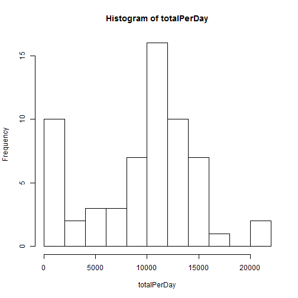
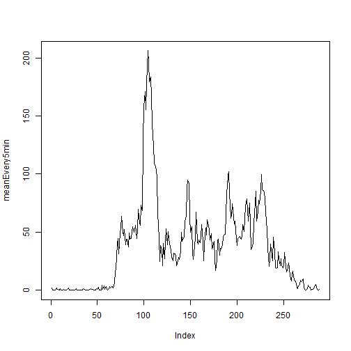
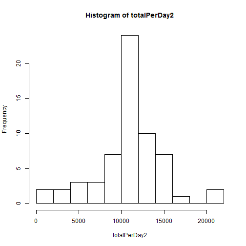
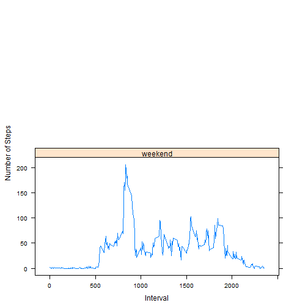

# Reproducible Research: Peer Assessment 1


## Loading and preprocessing the data
##### 1. Load the data (i.e. read.csv())


```r
data <- read.csv("activity.csv")
str(data)
```

```
## 'data.frame':	17568 obs. of  3 variables:
##  $ steps   : int  NA NA NA NA NA NA NA NA NA NA ...
##  $ date    : Factor w/ 61 levels "2012-10-01","2012-10-02",..: 1 1 1 1 1 1 1 1 1 1 ...
##  $ interval: int  0 5 10 15 20 25 30 35 40 45 ...
```

```r
head(data)
```

```
##   steps       date interval
## 1    NA 2012-10-01        0
## 2    NA 2012-10-01        5
## 3    NA 2012-10-01       10
## 4    NA 2012-10-01       15
## 5    NA 2012-10-01       20
## 6    NA 2012-10-01       25
```

## What is mean total number of steps taken per day?


```r
attach(data)
totalPerDay <- tapply(steps,list(date),sum,na.rm=TRUE)
detach(data)
```

##### 1. Make a histogram of the total number of steps taken each day


```r
hist(totalPerDay,breaks=10)
```




##### 2. Calculate and report the mean and median total number of steps taken per day


```r
meanPerDay = mean(totalPerDay,na.rm = TRUE)
meanPerDay
```

```
## [1] 9354.23
```

```r
medianPerDay <- median(totalPerDay,na.rm = TRUE)
medianPerDay
```

```
## [1] 10395
```


-----

## What is the average daily activity pattern?


```r
attach(data)
meanEvery5min <- tapply(steps,list(interval),mean,na.rm=TRUE)
detach(data)
```

##### 1. Make a time series plot


```r
plot(meanEvery5min,type="l")
```



##### 2. Which 5-minute interval, on average across all the days in the dataset, contains the maximum number of steps?


```r
which.max(meanEvery5min)
```

```
## 835 
## 104
```

```r
meanEvery5min[104]
```

```
##      835 
## 206.1698
```

```r
max(meanEvery5min)
```

```
## [1] 206.1698
```

## Imputing missing values
##### 1. Calculate and report the total number of missing values in the dataset 


```r
calMissing <- sum(is.na(data$steps))
calMissing
```

```
## [1] 2304
```

##### 2. Devise a strategy for filling in all of the missing values in the dataset.
##### 3. Create a new dataset that is equal to the original dataset but with the missing data filled in.


```r
na <- is.na(data$steps)
shiftmeanEvery5min <- c(meanEvery5min[288],meanEvery5min[1:287])
imputedSteps <- rep(0,length(data$steps))
for (i in 1:length(data$steps))
{
  if(na[i])
    {
      imputedSteps[i] <- shiftmeanEvery5min[i%%length(meanEvery5min)+1]
    }
  else
    {
      imputedSteps[i] <- data$steps[i]
    } 
}

#data <- transform(data, data$imputedSteps = imputedSteps)
data <- cbind(data,imputedSteps)
str(data)
```

```
## 'data.frame':	17568 obs. of  4 variables:
##  $ steps       : int  NA NA NA NA NA NA NA NA NA NA ...
##  $ date        : Factor w/ 61 levels "2012-10-01","2012-10-02",..: 1 1 1 1 1 1 1 1 1 1 ...
##  $ interval    : int  0 5 10 15 20 25 30 35 40 45 ...
##  $ imputedSteps: num  1.717 0.3396 0.1321 0.1509 0.0755 ...
```

```r
head(data)
```

```
##   steps       date interval imputedSteps
## 1    NA 2012-10-01        0    1.7169811
## 2    NA 2012-10-01        5    0.3396226
## 3    NA 2012-10-01       10    0.1320755
## 4    NA 2012-10-01       15    0.1509434
## 5    NA 2012-10-01       20    0.0754717
## 6    NA 2012-10-01       25    2.0943396
```

```r
attach(data)
```

```
## The following object is masked _by_ .GlobalEnv:
## 
##     imputedSteps
```

##### 4. Make a histogram of the total number of steps taken each day 


```r
totalPerDay2 <- tapply(imputedSteps,list(date),sum)
detach(data)
hist(totalPerDay2,breaks=10)
```



#### ... and Calculate and report the mean and median total number of steps taken per day. 


```r
mean(totalPerDay2)
```

```
## [1] 10766.19
```

```r
median(totalPerDay2)
```

```
## [1] 10766.19
```


## Are there differences in activity patterns between weekdays and weekends?
##### 1.Create a new factor variable in the dataset with two levels - "weekday" and "weekend" indicating whether a given date is a weekday or weekend day.


```r
#isweekday <- factor(c("weekday", "weekends"))
date <- levels(data$date)
daytype <- weekdays(as.Date(date))
for(i in 1:length(daytype))
  {
    if(daytype[i] %in% c("?????????", "?????????", "?????????", "?????????", "?????????"))
      {
        daytype[i] <- "weekday"
      }
    else
      {
        daytype[i] <- "weekend"
      }
  }
daytype <- as.factor(daytype)
isweekday <- rep(daytype,each=length(meanEvery5min))

data <- cbind(data,isweekday)
str(data)
```

```
## 'data.frame':	17568 obs. of  5 variables:
##  $ steps       : int  NA NA NA NA NA NA NA NA NA NA ...
##  $ date        : Factor w/ 61 levels "2012-10-01","2012-10-02",..: 1 1 1 1 1 1 1 1 1 1 ...
##  $ interval    : int  0 5 10 15 20 25 30 35 40 45 ...
##  $ imputedSteps: num  1.717 0.3396 0.1321 0.1509 0.0755 ...
##  $ isweekday   : Factor w/ 1 level "weekend": 1 1 1 1 1 1 1 1 1 1 ...
```

```r
head(data)
```

```
##   steps       date interval imputedSteps isweekday
## 1    NA 2012-10-01        0    1.7169811   weekend
## 2    NA 2012-10-01        5    0.3396226   weekend
## 3    NA 2012-10-01       10    0.1320755   weekend
## 4    NA 2012-10-01       15    0.1509434   weekend
## 5    NA 2012-10-01       20    0.0754717   weekend
## 6    NA 2012-10-01       25    2.0943396   weekend
```

```r
attach(data)
```

```
## The following objects are masked _by_ .GlobalEnv:
## 
##     date, imputedSteps, isweekday
```

##### 2.Make a panel plot containing a time series plot


```r
daytypeDiff <- aggregate(imputedSteps, list(interval,isweekday), mean)
detach(data)
library(lattice)
xyplot(x ~ Group.1|Group.2,data=daytypeDiff,type="l",layout=c(1,2),xlab="Interval",ylab="Number of Steps")
```


